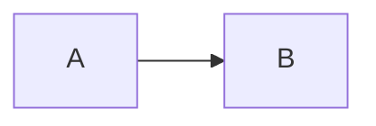
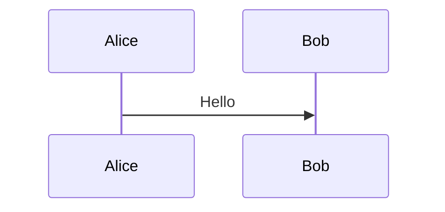
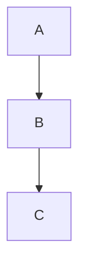

# Markdown 图片与 Mermaid 图表尺寸/位置控制实现计划

> **For agentic workers:** REQUIRED SUB-SKILL: Use superpowers:subagent-driven-development (recommended) or superpowers:executing-plans to implement this plan task-by-task. Steps use checkbox (`- [ ]`) syntax for tracking.

**Goal:** 为 Markdown 中的图片和 Mermaid 图表添加尺寸控制和对齐能力，使用统一的 HTML 属性语法 `{ width=300 align=center }`。

**Architecture:** 创建 remark 插件解析属性块，将属性存储到节点 data 字段，在 ReactMarkdown components 层读取并应用 CSS 样式。

**Tech Stack:** ReactMarkdown, unified (remark), TypeScript, Vitest

---

## 文件结构

| 文件 | 操作 | 说明 |
|------|------|------|
| `apps/desktop/src/lib/remark-attr-parser.ts` | 新建 | remark 插件：解析 `{ ... }` 属性块 |
| `apps/desktop/src/__tests__/lib/remark-attr-parser.test.ts` | 新建 | 插件单元测试 |
| `apps/desktop/src/components/claude-chat/markdown-renderer.tsx` | 修改 | 应用插件，修改 img 和 MermaidBlock 样式逻辑 |

---

## Task 1: 创建 remark-attr-parser 插件

**Files:**
- Create: `apps/desktop/src/lib/remark-attr-parser.ts`

- [ ] **Step 1: 创建插件骨架和类型定义**

```typescript
// apps/desktop/src/lib/remark-attr-parser.ts
import { visit } from "unist-util-visit";
import type { Plugin, Transformer } from "unified";
import type { Root, Image, Code, Text } from "mdast";

export interface Attrs {
  width?: string;  // "300" or "50%"
  height?: string; // "200"
  align?: "left" | "center" | "right";
}

export interface AttrNodeData {
  attrs?: Attrs;
}

/**
 * Remark plugin to parse `{ width=300 align=center }` attribute blocks.
 * 
 * For images: attributes follow the image in a text node
 * For code blocks: attributes are in the lang field after language name
 */
export const remarkAttrParser: Plugin<[], Root> = () => {
  const transformer: Transformer<Root> = (tree) => {
    visit(tree, (node, index, parent) => {
      // Handle code blocks with attributes in lang field
      if (node.type === "code" && node.lang) {
        const result = parseCodeLang(node.lang);
        if (result.attrs) {
          (node.data as AttrNodeData | undefined) = { attrs: result.attrs };
          node.lang = result.lang;
        }
      }

      // Handle images with attributes in following text node
      if (node.type === "image" && parent && index !== null) {
        const nextNode = parent.children[index + 1];
        if (nextNode?.type === "text") {
          const result = parseAttrBlock(nextNode.value);
          if (result.attrs) {
            (node.data as AttrNodeData | undefined) = { attrs: result.attrs };
            // Remove the attribute block text
            if (result.remaining === "") {
              parent.children.splice(index + 1, 1);
            } else {
              nextNode.value = result.remaining;
            }
          }
        }
      }
    });
    return tree;
  };
  return transformer;
};

/**
 * Parse code block lang field: "mermaid { width=500 }"
 * Returns: { lang: "mermaid", attrs: { width: "500" } }
 */
function parseCodeLang(langField: string): { lang: string; attrs?: Attrs } {
  const match = langField.match(/^(\w+)\s*\{([^}]*)\}$/);
  if (!match) {
    return { lang: langField };
  }
  const lang = match[1];
  const attrString = match[2];
  const attrs = parseAttrs(attrString);
  return { lang, attrs };
}

/**
 * Parse attribute block text: "{ width=300 align=center }"
 * Returns: { attrs: { ... }, remaining: "..." }
 */
function parseAttrBlock(text: string): { attrs?: Attrs; remaining: string } {
  const match = text.match(/^\s*\{([^}]*)\}\s*/);
  if (!match) {
    return { remaining: text };
  }
  const attrString = match[1];
  const attrs = parseAttrs(attrString);
  const remaining = text.slice(match[0].length);
  return { attrs, remaining };
}

/**
 * Parse individual attributes: "width=300 align=center"
 */
function parseAttrs(attrString: string): Attrs {
  const attrs: Attrs = {};
  const parts = attrString.trim().split(/\s+/);
  
  for (const part of parts) {
    const [key, value] = part.split("=");
    if (!key || !value) continue;
    
    if (key === "width") {
      // Allow "300" or "50%"
      if (/^\d+$/.test(value) || /^\d+%$/.test(value)) {
        attrs.width = value;
      }
    } else if (key === "height") {
      if (/^\d+$/.test(value)) {
        attrs.height = value;
      }
    } else if (key === "align") {
      if (value === "left" || value === "center" || value === "right") {
        attrs.align = value;
      }
    }
  }
  
  return attrs;
}

export default remarkAttrParser;
```

- [ ] **Step 2: 安装 unist-util-visit 依赖**

Run: `cd apps/desktop && pnpm add unist-util-visit`

Expected: dependency installed successfully

- [ ] **Step 3: 验证 TypeScript 编译通过**

Run: `cd apps/desktop && pnpm tsc --noEmit`

Expected: no errors

- [ ] **Step 4: Commit 插件骨架**

```bash
git add apps/desktop/src/lib/remark-attr-parser.ts apps/desktop/package.json apps/desktop/pnpm-lock.yaml
git commit -m "feat: add remark-attr-parser plugin skeleton"
```

---

## Task 2: 编写插件单元测试

**Files:**
- Create: `apps/desktop/src/__tests__/lib/remark-attr-parser.test.ts`

- [ ] **Step 1: 创建测试文件**

```typescript
// apps/desktop/src/__tests__/lib/remark-attr-parser.test.ts
import { describe, it, expect } from "vitest";
import remarkAttrParser, { type Attrs } from "@/lib/remark-attr-parser";
import { remark } from "remark";

describe("remark-attr-parser", () => {
  describe("parseAttrs", () => {
    it("parses width as pixels", () => {
      const markdown = "{ width=300 }";
      const result = processMarkdown(markdown);
      expect(result.imageAttrs?.width).toBe("300");
    });

    it("parses width as percentage", () => {
      const markdown = "{ width=50% }";
      const result = processMarkdown(markdown);
      expect(result.imageAttrs?.width).toBe("50%");
    });

    it("parses height", () => {
      const markdown = "{ height=200 }";
      const result = processMarkdown(markdown);
      expect(result.imageAttrs?.height).toBe("200");
    });

    it("parses align", () => {
      const markdown = "{ align=left }";
      const result = processMarkdown(markdown);
      expect(result.imageAttrs?.align).toBe("left");
    });

    it("parses multiple attributes", () => {
      const markdown = "{ width=300 height=200 align=center }";
      const result = processMarkdown(markdown);
      expect(result.imageAttrs).toEqual({
        width: "300",
        height: "200",
        align: "center",
      });
    });

    it("ignores invalid attribute values", () => {
      const markdown = "{ width=abc align=invalid }";
      const result = processMarkdown(markdown);
      expect(result.imageAttrs).toEqual({});
    });

    it("handles attributes in any order", () => {
      const markdown = "{ align=right width=400 }";
      const result = processMarkdown(markdown);
      expect(result.imageAttrs?.align).toBe("right");
      expect(result.imageAttrs?.width).toBe("400");
    });
  });

  describe("code block parsing", () => {
    it("parses attributes from mermaid code block", () => {
      const markdown = "```mermaid { width=500 }\ngraph LR\n  A --> B\n```";
      const result = processMarkdown(markdown);
      expect(result.codeAttrs?.width).toBe("500");
      expect(result.codeLang).toBe("mermaid");
    });

    it("parses align from code block", () => {
      const markdown = "```mermaid { width=600 align=left }\ngraph LR\n  A --> B\n```";
      const result = processMarkdown(markdown);
      expect(result.codeAttrs).toEqual({
        width: "600",
        align: "left",
      });
    });

    it("handles code block without attributes", () => {
      const markdown = "```mermaid\ngraph LR\n  A --> B\n```";
      const result = processMarkdown(markdown);
      expect(result.codeAttrs).toBeUndefined();
      expect(result.codeLang).toBe("mermaid");
    });
  });

  describe("edge cases", () => {
    it("handles image without attribute block", () => {
      const markdown = "";
      const result = processMarkdown(markdown);
      expect(result.imageAttrs).toBeUndefined();
    });

    it("removes attribute block from text after image", () => {
      const markdown = "{ width=300 }";
      const result = processMarkdown(markdown);
      expect(result.remainingText).toBe("");
    });

    it("preserves text after attribute block", () => {
      const markdown = "{ width=300 } more text";
      const result = processMarkdown(markdown);
      expect(result.remainingText).toBe("more text");
    });

    it("does not parse malformed attribute block", () => {
      const markdown = "{ width }";
      const result = processMarkdown(markdown);
      expect(result.imageAttrs).toBeUndefined();
    });
  });
});

// Helper to process markdown and extract attrs
function processMarkdown(markdown: string) {
  const tree = remark().use(remarkAttrParser).parse(markdown);
  
  let imageAttrs: Attrs | undefined;
  let codeAttrs: Attrs | undefined;
  let codeLang: string | undefined;
  let remainingText = "";
  
  for (const node of tree.children) {
    if (node.type === "paragraph") {
      for (const child of node.children) {
        if (child.type === "image") {
          imageAttrs = (child.data as { attrs?: Attrs })?.attrs;
        }
        if (child.type === "text") {
          remainingText = child.value;
        }
      }
    }
    if (node.type === "code") {
      codeAttrs = (node.data as { attrs?: Attrs })?.attrs;
      codeLang = node.lang;
    }
  }
  
  return { imageAttrs, codeAttrs, codeLang, remainingText };
}
```

- [ ] **Step 2: 运行测试验证**

Run: `cd apps/desktop && pnpm test apps/desktop/src/__tests__/lib/remark-attr-parser.test.ts`

Expected: All tests pass

- [ ] **Step 3: Commit 测试文件**

```bash
git add apps/desktop/src/__tests__/lib/remark-attr-parser.test.ts
git commit -m "test: add unit tests for remark-attr-parser"
```

---

## Task 3: 修改 MarkdownRenderer 应用插件

**Files:**
- Modify: `apps/desktop/src/components/claude-chat/markdown-renderer.tsx`

- [ ] **Step 1: 导入插件并添加到 remarkPlugins**

修改文件 `apps/desktop/src/components/claude-chat/markdown-renderer.tsx`:

在文件顶部导入区域添加导入:

```typescript
// 在第6行 mermaid 导入之后添加
import remarkAttrParser, { type Attrs } from "@/lib/remark-attr-parser";
```

修改 ReactMarkdown 的 remarkPlugins 配置（约第197行）:

```typescript
// 原代码:
remarkPlugins={[remarkGfm, remarkMath]}

// 改为:
remarkPlugins={[remarkAttrParser, remarkGfm, remarkMath]}
```

注意: remarkAttrParser 必须放在最前面，在 remarkGfm 和 remarkMath 之前执行。

- [ ] **Step 2: 创建样式计算辅助函数**

在 `MermaidBlock` 组件之前添加辅助函数:

```typescript
// 在第82行之前添加

/**
 * Compute CSS styles from parsed attributes
 */
function computeStylesFromAttrs(attrs?: Attrs): {
  containerStyle: React.CSSProperties;
  imgStyle: React.CSSProperties;
} {
  const containerStyle: React.CSSProperties = {};
  const imgStyle: React.CSSProperties = { display: "block" };

  if (!attrs) {
    // Default: full width, centered
    containerStyle.width = "100%";
    containerStyle.margin = "0 auto";
    return { containerStyle, imgStyle };
  }

  // Width
  if (attrs.width) {
    const widthValue = attrs.width.endsWith("%") ? attrs.width : `${attrs.width}px`;
    containerStyle.width = widthValue;
    imgStyle.width = widthValue;
  }

  // Height (only for images)
  if (attrs.height) {
    imgStyle.height = `${attrs.height}px`;
  }

  // Alignment
  switch (attrs.align) {
    case "left":
      containerStyle.marginLeft = "0";
      containerStyle.marginRight = "auto";
      imgStyle.marginLeft = "0";
      imgStyle.marginRight = "auto";
      break;
    case "right":
      containerStyle.marginLeft = "auto";
      containerStyle.marginRight = "0";
      imgStyle.marginLeft = "auto";
      imgStyle.marginRight = "0";
      break;
    case "center":
    default:
      containerStyle.margin = "0 auto";
      imgStyle.margin = "0 auto";
      break;
  }

  return { containerStyle, imgStyle };
}
```

- [ ] **Step 3: 验证 TypeScript 编译通过**

Run: `cd apps/desktop && pnpm tsc --noEmit`

Expected: no errors

- [ ] **Step 4: Commit 辅助函数**

```bash
git add apps/desktop/src/components/claude-chat/markdown-renderer.tsx
git commit -m "feat: add computeStylesFromAttrs helper and import plugin"
```

---

## Task 4: 修改 MermaidBlock 支持属性

**Files:**
- Modify: `apps/desktop/src/components/claude-chat/markdown-renderer.tsx:84-179`

- [ ] **Step 1: 更新 MermaidBlock 接收 attrs prop**

修改 `MermaidBlock` 组件定义（约第84行）:

```typescript
// 原代码:
const MermaidBlock: FC<{ code: string }> = ({ code }) => {

// 改为:
const MermaidBlock: FC<{ code: string; attrs?: Attrs }> = ({ code, attrs }) => {
```

- [ ] **Step 2: 在 MermaidBlock 中应用样式**

修改 `MermaidBlock` 渲染部分（约第173-179行）:

```typescript
// 在函数开始处计算样式:
const MermaidBlock: FC<{ code: string; attrs?: Attrs }> = ({ code, attrs }) => {
  const containerRef = useRef<HTMLDivElement>(null);
  const [error, setError] = useState<string | null>(null);
  
  // Compute styles from attrs
  const { containerStyle } = computeStylesFromAttrs(attrs);

  // ... existing useEffect for rendering ...

  // 修改 return 语句，添加 style 属性:
  return (
    <div
      ref={containerRef}
      className="mermaid-block my-2 max-w-full overflow-hidden rounded-lg bg-muted/50 p-4"
      style={containerStyle}
    />
  );
};
```

- [ ] **Step 3: 验证 TypeScript 编译通过**

Run: `cd apps/desktop && pnpm tsc --noEmit`

Expected: no errors

- [ ] **Step 4: Commit MermaidBlock 更改**

```bash
git add apps/desktop/src/components/claude-chat/markdown-renderer.tsx
git commit -m "feat: apply attrs styles to MermaidBlock container"
```

---

## Task 5: 修改 code component 传递属性给 MermaidBlock

**Files:**
- Modify: `apps/desktop/src/components/claude-chat/markdown-renderer.tsx:238-260`

- [ ] **Step 1: 在 code component 中提取 attrs 并传递给 MermaidBlock**

修改 `code` component（约第238-260行）:

```typescript
// 原代码:
code({ className: codeClassName, children, node, ...props }) {
  const match = /language-(\w+)/.exec(codeClassName || "");
  const language = match?.[1];
  const code = String(children).replace(/\n$/, "");
  const isBlock =
    node?.position &&
    node.position.start.line !== node.position.end.line;

  if (!match && !isBlock) {
    return (
      <code className={codeClassName} {...props}>
        {children}
      </code>
    );
  }

  // Handle mermaid diagrams
  if (language === "mermaid") {
    return <MermaidBlock code={code} />;
  }

  return <CodeBlock language={language || ""} code={code} />;
}

// 改为:
code({ className: codeClassName, children, node, ...props }) {
  const match = /language-(\w+)/.exec(codeClassName || "");
  const language = match?.[1];
  const code = String(children).replace(/\n$/, "");
  const isBlock =
    node?.position &&
    node.position.start.line !== node.position.end.line;

  // Extract attrs from node data (set by remarkAttrParser)
  const attrs = (node?.data as { attrs?: Attrs })?.attrs;

  if (!match && !isBlock) {
    return (
      <code className={codeClassName} {...props}>
        {children}
      </code>
    );
  }

  // Handle mermaid diagrams
  if (language === "mermaid") {
    return <MermaidBlock code={code} attrs={attrs} />;
  }

  return <CodeBlock language={language || ""} code={code} />;
}
```

- [ ] **Step 2: 验证 TypeScript 编译通过**

Run: `cd apps/desktop && pnpm tsc --noEmit`

Expected: no errors

- [ ] **Step 3: Commit code component 更改**

```bash
git add apps/desktop/src/components/claude-chat/markdown-renderer.tsx
git commit -m "feat: pass attrs from code node to MermaidBlock"
```

---

## Task 6: 修改 img component 应用样式

**Files:**
- Modify: `apps/desktop/src/components/claude-chat/markdown-renderer.tsx:202-234`

- [ ] **Step 1: 在 img component 中提取 attrs 并应用样式**

修改 `img` component（约第202-234行）:

```typescript
// 原代码:
img({ src, alt }) {
  console.log("[MarkdownRenderer] img handler called", { src, projectRoot, hasProjectRoot: !!projectRoot });

  // Skip external URLs and data URLs
  if (
    !src ||
    src.startsWith("http://") ||
    src.startsWith("https://") ||
    src.startsWith("data:")
  ) {
    return ;
  }

  // For relative paths...
  if (!projectRoot) {
    return (
      <span className="inline-block rounded bg-muted px-2 py-1 text-muted-foreground text-sm">
        [Image loading...]
      </span>
    );
  }

  // Convert relative path...
  const normalizedSrc = src.replace(/\\/g, "/");
  const absolutePath = normalizedSrc.startsWith("/")
    ? normalizedSrc
    : `${projectRoot}/${normalizedSrc}`;
  const assetUrl = convertFileSrc(absolutePath);
  return ;
}

// 改为:
img({ src, alt, node }) {
  console.log("[MarkdownRenderer] img handler called", { src, projectRoot, hasProjectRoot: !!projectRoot });

  // Extract attrs from node data (set by remarkAttrParser)
  const attrs = (node?.data as { attrs?: Attrs })?.attrs;
  const { imgStyle } = computeStylesFromAttrs(attrs);

  // Skip external URLs and data URLs
  if (
    !src ||
    src.startsWith("http://") ||
    src.startsWith("https://") ||
    src.startsWith("data:")
  ) {
    return ;
  }

  // For relative paths...
  if (!projectRoot) {
    return (
      <span className="inline-block rounded bg-muted px-2 py-1 text-muted-foreground text-sm">
        [Image loading...]
      </span>
    );
  }

  // Convert relative path...
  const normalizedSrc = src.replace(/\\/g, "/");
  const absolutePath = normalizedSrc.startsWith("/")
    ? normalizedSrc
    : `${projectRoot}/${normalizedSrc}`;
  const assetUrl = convertFileSrc(absolutePath);
  return ;
}
```

- [ ] **Step 2: 验证 TypeScript 编译通过**

Run: `cd apps/desktop && pnpm tsc --noEmit`

Expected: no errors

- [ ] **Step 3: Commit img component 更改**

```bash
git add apps/desktop/src/components/claude-chat/markdown-renderer.tsx
git commit -m "feat: apply attrs styles to img elements"
```

---

## Task 7: 手动测试验证

**Files:**
- 无文件修改

- [ ] **Step 1: 启动开发服务器**

Run: `cd apps/desktop && pnpm dev`

Expected: Dev server running at http://localhost:1420

- [ ] **Step 2: 创建测试 Markdown 文件**

在任意打开的项目中创建测试 Markdown 文件，包含以下内容:

```markdown
## 图片测试

### 基本尺寸
{ width=300 }

### 尺寸+对齐
{ width=300 align=left }

### 百分比宽度居中
{ width=50% align=center }

### 高度控制
{ width=300 height=200 }

### 无属性块 (默认)


## Mermaid 测试

### 基本尺寸


### 尺寸+对齐


### 百分比宽度


### 无属性块 (默认)

```

- [ ] **Step 3: 验证渲染结果**

在预览面板中检查:
1. 图片尺寸是否按属性值显示
2. 图片对齐是否正确（左/中/右）
3. Mermaid 图表容器宽度是否正确
4. Mermaid 图表对齐是否正确
5. 无属性块时使用默认样式

- [ ] **Step 4: 验证 TypeScript 编译通过**

Run: `cd apps/desktop && pnpm tsc --noEmit`

Expected: no errors

---

## Task 8: 运行测试套件

**Files:**
- 无文件修改

- [ ] **Step 1: 运行完整测试套件**

Run: `cd apps/desktop && pnpm test`

Expected: All tests pass

- [ ] **Step 2: Commit 最终状态**

```bash
git add -A
git commit -m "feat: complete markdown image/mermaid size and alignment control"
```

---

## 验收标准

1. 图片支持 `width`（像素/百分比）、`height`、`align` 属性
2. Mermaid 图表支持 `width`（像素/百分比）、`align` 属性
3. 对齐为 block 级别，文字不环绕
4. 无属性块时使用默认值
5. 无效属性值被忽略
6. 与现有功能兼容