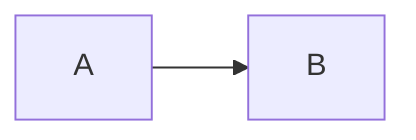
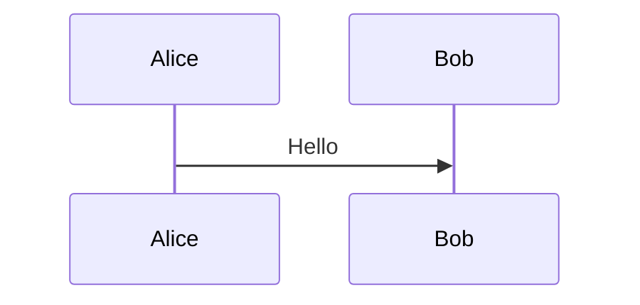
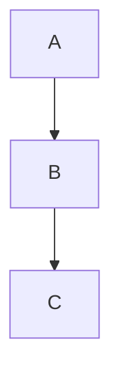

# Markdown 图片与 Mermaid 图表尺寸/位置控制设计文档

> **For agentic workers:** REQUIRED SUB-SKILL: Use superpowers:subagent-driven-development (recommended) or superpowers:executing-plans to implement this plan task-by-task.

**Goal:** 为 Markdown 中的图片和 Mermaid 图表添加尺寸控制和对齐能力，使用统一的 HTML 属性语法。

**Architecture:** 通过自定义 remark/rehype 插件解析 `{ ... }` 属性块，将尺寸和对齐信息注入到渲染元素，在 ReactMarkdown components 层应用相应的 CSS 样式。

**Tech Stack:** ReactMarkdown, remark-gfm, rehype-katex, 自定义 remark/rehype 插件

---

## 一、语法规范

### 1.1 语法格式

采用 HTML 属性语法，紧跟在元素后面：

```markdown
{ width=300 height=200 align=center }


```

### 1.2 属性定义

| 属性 | 格式 | 示例 | 适用元素 | 默认值 |
|------|------|------|----------|--------|
| `width` | 数字(像素) 或 百分比 | `width=300` 或 `width=50%` | 图片、Mermaid | 图片原尺寸，Mermaid 100% |
| `height` | 数字(像素) | `height=200` | 图片、Mermaid | 自动 |
| `align` | `left` / `center` / `right` | `align=center` | 图片、Mermaid | `center` |

### 1.3 语法规则

- 属性块 `{ ... }` 可选，不写则使用默认值
- 多属性空格分隔，顺序不限
- 属性值不带单位（像素为默认单位，百分比需显式 `%`）
- 对齐为 **block 级别**，文字不环绕图片/图表

---

## 二、渲染行为

### 2.1 图片渲染

图片始终以 block 级别渲染，通过 CSS margin 控制对齐：

```html
<!-- align=center (默认) -->


<!-- align=left -->


<!-- align=right -->

```

### 2.2 Mermaid 图表渲染

Mermaid 通过容器 div 控制尺寸和对齐：

```html
<!-- width=500 align=center -->
<div class="mermaid-block" style="width:500px; margin:0 auto;">
  <svg style="max-width:100%; height:auto;">...</svg>
</div>

<!-- width=50% align=left -->
<div class="mermaid-block" style="width:50%; margin-left:0; margin-right:auto;">
  <svg style="max-width:100%; height:auto;">...</svg>
</div>

<!-- 无属性块 (默认) -->
<div class="mermaid-block" style="width:100%; margin:0 auto;">
  <svg style="max-width:100%; height:auto;">...</svg>
</div>
```

---

## 三、技术实现

### 3.1 文件结构

| 文件 | 操作 | 说明 |
|------|------|------|
| `src/lib/remark-attr-parser.ts` | 新建 | remark 插件：解析 `{ ... }` 属性块 |
| `src/lib/rehype-apply-attrs.ts` | 新建 | rehype 插件：将属性注入到 HTML 元素 |
| `src/components/claude-chat/markdown-renderer.tsx` | 修改 | 应用新插件，调整 img 和 MermaidBlock 组件 |

### 3.2 解析流程

```
Markdown 源码
  ↓ remark-attr-parser (识别 { ... }，提取属性，存储到节点 data)
  ↓ remark-gfm (GFM 扩展语法)
  ↓ remark-math (数学公式)
  ↓ remark-rehype (Markdown 转 HTML AST)
  ↓ rehype-katex (KaTeX 渲染)
  ↓ rehype-apply-attrs (从节点 data 读取属性，注入到 HTML 元素 props)
  ↓ ReactMarkdown components (根据 props 应用样式)
渲染结果
```

### 3.3 remark-attr-parser 插件

**职责：**
1. 遍历 Markdown AST，检测属性块位置
2. 解析属性内容（`width=300`, `align=center` 等）
3. 将解析结果存储到目标节点的 `data.attrs` 字段
4. 清理属性块（避免渲染为普通文本）

**属性块位置检测：**

| 元素类型 | 属性块位置 | 示例 |
|----------|------------|------|
| image | 紧跟图片节点后的文本节点 | `{ width=300 }` |
| code (fenced) | 语言标识同一行，` ``` ` 后面 | ` ```mermaid { width=500 } ` |

**Code block 解析逻辑：**
- Code fence 的 `lang` 字段（如 `mermaid`）可能包含额外文本
- 检测 `lang` 字段是否匹配模式：`langName { attrs }`
- 将 `langName` 提取为纯语言标识
- 将 `{ attrs }` 解析为属性对象，存储到 code 节点的 `data.attrs`

**匹配规则：**
- 属性块格式：`{ key=value key=value }`
- 值可以是：纯数字（像素）、数字+`%`（百分比）、字符串（如 `center`）
- 无效值被忽略

### 3.4 rehype-apply-attrs 插件

**职责：**
1. 遍历 HTML AST (hast)
2. 查找带有 `data.attrs` 的元素节点（从 remark 转换而来）
3. 将 `data.attrs` 合并到元素的 `properties` 中
4. 添加特殊属性 `data-width`, `data-height`, `data-align` 供 ReactMarkdown components 使用

### 3.5 ReactMarkdown components 修改

**img component：**
- 从 props 读取 `data-width`, `data-height`, `data-align`
- 根据属性值计算并应用 inline style
- 保持现有的 Tauri asset URL 转换逻辑

**MermaidBlock component：**
- 接收 `width`, `height`, `align` props（通过 code 节点的 data 传递）
- 使用容器 div 包裹 SVG
- 根据 props 设置容器 div 的样式

---

## 四、边界情况处理

| 场景 | 处理方式 |
|------|----------|
| 属性值无效（如 `width=abc`） | 忽略该属性，使用默认值 |
| 属性块位置错误（非紧跟元素） | 不解析，当作普通文本渲染 |
| 缺少部分属性（如只有 `align=left`） | 其他属性使用默认值 |
| Mermaid 语法错误 | 保持现有的错误提示 UI |
| 图片路径为外部 URL | 属性仍生效，样式正常应用 |
| 百分比宽度超出容器 | 受容器约束，不会溢出 |
| height 设置但未设置 width | 图片可能变形，建议同时设置 |

---

## 五、与 Mermaid 原生 directive 的关系

Mermaid 原生支持 `%%{init: ...}%%` directive 用于配置主题、字体等：

```markdown
%%{init: { "theme": "dark", "fontSize": "16px" }}%%
graph LR
  A --> B
```

**共存规则：**
- `{ ... }` 属性块：控制尺寸和对齐（本方案）
- `%%{init: ...}%%`：保持 Mermaid 原生功能（主题、字体等内部配置）
- 两者可同时使用，互不干扰

---

## 六、测试场景

### 6.1 图片测试

```markdown
<!-- 基本尺寸 -->
{ width=300 }

<!-- 尺寸+对齐 -->
{ width=300 align=left }

<!-- 百分比宽度 -->
{ width=50% align=center }

<!-- 高度控制 -->
{ width=300 height=200 }

<!-- 无属性块 -->


<!-- 外部 URL -->
{ width=400 align=right }
```

### 6.2 Mermaid 测试

```markdown
<!-- 基本尺寸 -->


<!-- 尺寸+对齐 -->


<!-- 百分比宽度 -->


<!-- 与原生 directive 共存 -->
%%{init: { "theme": "dark" }}%%


<!-- 无属性块 -->

```

---

## 七、验收标准

1. 图片支持 `width`（像素/百分比）、`height`、`align` 属性
2. Mermaid 图表支持 `width`（像素/百分比）、`align` 属性
3. 对齐为 block 级别，文字不环绕
4. 无属性块时使用默认值（保持现有行为）
5. 无效属性值被忽略，不影响渲染
6. 与现有功能兼容（图片 URL 转换、Mermaid 错误处理等）